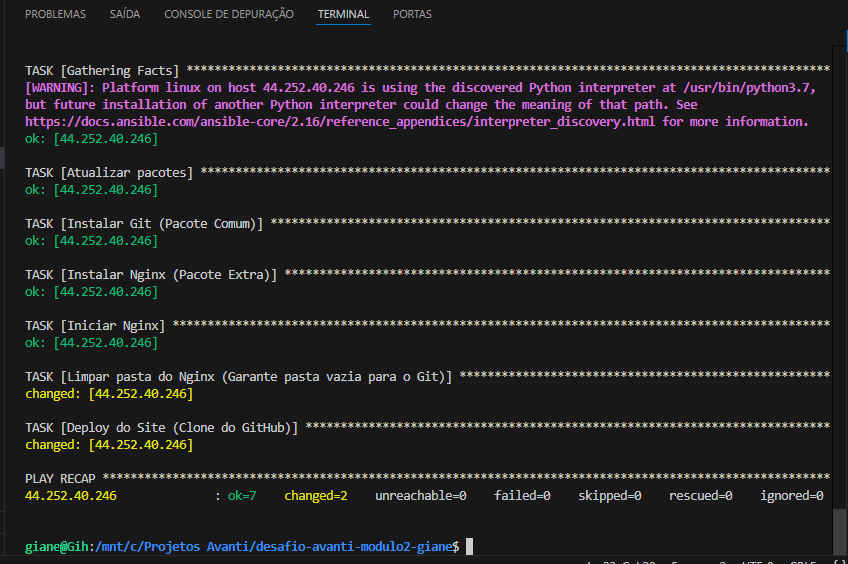
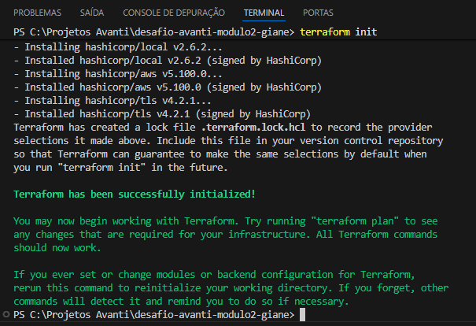
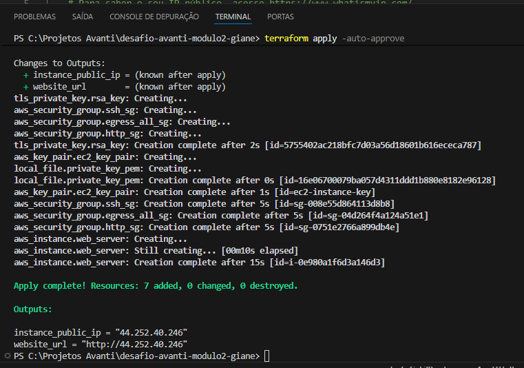
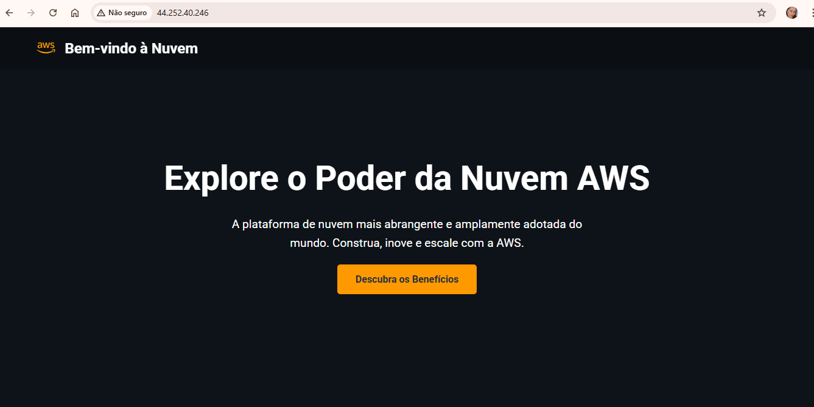
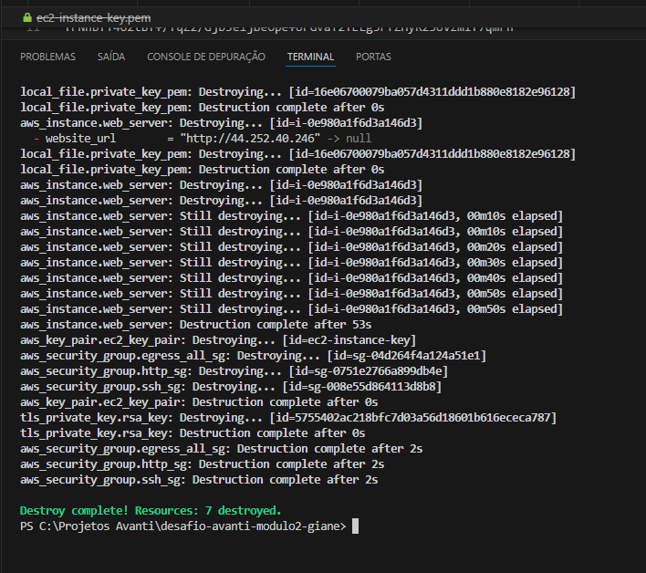

# Automação de Infraestrutura AWS: Terraform & Ansible

Este repositório contém o projeto de automação para o provisionamento e configuração de um servidor web na Amazon Web Services (AWS). O desafio demonstra o uso de Infraestrutura como Código (IaC) e gestão de configuração automatizada.

```
graph TD
    subgraph Local["Máquina Local"]
        TF[Terraform] -->|Provisiona| AWS
        AN[Ansible] -->|Configura| EC2
    end

    subgraph Nuvem["Nuvem AWS"]
        direction TB
        subgraph Rede["Rede e Segurança"]
            EC2["Instância EC2 (AL2)"]
            SG_SSH["Porta 22 (SSH)"]
            SG_HTTP["Porta 80 (HTTP)"]
            EC2 --- SG_SSH
            EC2 --- SG_HTTP
        end
        
        subgraph App["Aplicação"]
            NGINX["Servidor Nginx"]
            GIT["Deploy via Git"]
            NGINX --- GIT
        end
    end

    EC2 --> NGINX
    Internet((Internet)) -->|Acesso Web| SG_HTTP
    ```

## 📂 Estrutura do Repositório

O projeto foi estrategicamente dividido em duas versões para demonstrar a evolução técnica e a capacidade de resolução de problemas (troubleshooting):

* **`v1-legado-al2/`**: Versão utilizando o **Amazon Linux 2**. Focada na compatibilidade com o ambiente legado e na superação de desafios técnicos com o gerenciador de pacotes antigo.
* **`v2-moderno-al2023/`**: Refatoração completa utilizando o **Amazon Linux 2023**. Implementação de práticas modernas com o gerenciador `dnf`, uso de handlers no Ansible e otimização do fluxo de deploy.

## 🛠️ Tecnologias e Ferramentas

* **Cloud:** AWS (EC2, VPC, Security Groups).
* **IaC:** Terraform.
* **Gestão de Configuração:** Ansible.
* **Servidor Web:** Nginx.
* **Linguagem:** HCL e YAML.

## 🛡️ Segurança e FinOps

Nota: Por questões de segurança e boas práticas de FinOps, a infraestrutura foi totalmente destruída via Terraform após a coleta das evidências, invalidando o IP público exposto nos logs e capturas de tela.

## 📸 Evidências do Projeto

Abaixo estão as capturas de tela que comprovam a execução bem-sucedida de todas as etapas do desafio:

### 1. Configuração com Ansible


### 2. Provisionamento com Terraform





### 3. Resultado Final


### 4. Encerramento (FinOps)


## 🎓 Créditos e Agradecimentos

Este projeto foi desenvolvido como parte do **Bootcamp da Escola Atlântico Avanti**.

* **Orientação:** Professor Thiago (Zozô) Augusto Ozores
* **Instituição:** Escola Atlântico Avanti.
* **Curso:** Devops

## 👤 Autora

**Giane Costa** Estudante de Análise e Desenvolvimento de Sistemas (ADS) - UNINTER.  
Cloud & DevOps em formação | Graduada AWS re/Start.

